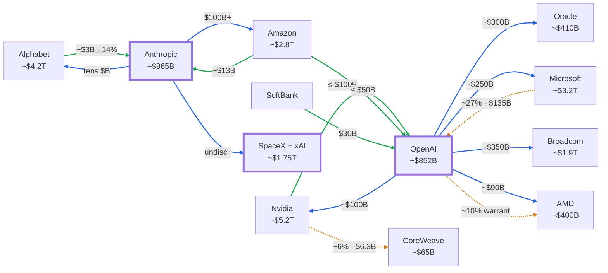

> [!CAUTION] Not financial advice — demonstration only
> This is an example / demonstration project. Figures may be provisional, inaccurate, or fictional; nothing here is financial or investment advice. See the [full disclaimer](/README.md).

## Summary

This is the knowledge base's **canonical reference** for the "AI capital web" — the dense network in which the same handful of firms (Nvidia, Microsoft, Amazon, Google, Oracle, AMD, Broadcom, CoreWeave) act as **investors, suppliers, and customers** of the 2026 IPO cohort ([OpenAI](/research/openai.md), [Anthropic](/research/anthropic.md), and [SpaceX](/research/spacex.md)).

The settled framing has three parts: (1) the web is described with **three edge types** — investment, compute purchase, and equity/warrant; (2) its defining feature is **"circular financing"** — money that loops back when a supplier invests in a customer who then buys that supplier's product; and (3) the **live figures and the full node/edge dataset stay in [research](/research/ai-funding-web.md)**, which this article supersedes as the canonical framing while deferring to it for the underlying numbers.

> [!NOTE] What "canonical" means here
> This article is the agreed, source-of-truth *description* of the capital web — its vocabulary and structure. It is intentionally stable. The provisional [research doc](/research/ai-funding-web.md) it supersedes still holds the volatile detail (snapshot valuations, the full edge table) that updates as new sources land.

## Body

### The three edge types

Every relationship in the web is one of three kinds. This taxonomy is the canonical vocabulary the rest of the KB should use when describing a tie:

| Edge type | Meaning | Canonical example |
| --- | --- | --- |
| **Investment** | A firm puts equity capital *into* a lab | Nvidia → OpenAI (up to $100B) |
| **Compute purchase** | A lab commits to *buy* cloud / chips from a firm | OpenAI → Oracle (\~$300B) |
| **Equity / warrant** | A stake, warrant, or backstop tied to a commercial deal | OpenAI ⇢ AMD (\~10% warrant) |

### Anchor nodes

The web has two tiers. The **labs** are the 2026 IPO cohort at the center; the **counterparties** are the public mega-caps that surround them. Node size = market value / valuation (a mid-2026 snapshot; see [research](/research/ai-funding-web.md) for the sourced table).

- **Labs (impending IPO):** [OpenAI](/research/openai.md) (~~$852B), [Anthropic](/research/anthropic.md) (~~$965B), [SpaceX + xAI](/research/spacex.md) (\~$1.75T target).
- **Counterparties:** Nvidia (~~$5.2T), Alphabet (~~$4.2T), Microsoft (~~$3.2T), Amazon (~~$2.8T), Broadcom (~~$1.9T), Oracle (~~$410B), AMD, CoreWeave.

### The web at a glance

The canonical shape of the web — node labels carry valuation, arrows are colored by the three edge types above (dashed = equity / warrant). Figures and per-deal sources are in the [research dataset](/research/ai-funding-web.md).

### Why it's called "circular financing"

The canonical definition: **a supplier invests in a customer, and that customer commits the money back to buy the supplier's product** — so the same dollars appear on both sides of the relationship. The clearest loops:

- **Nvidia ⇄ OpenAI** — Nvidia invests up to $100B into OpenAI; OpenAI commits \~$100B to buy Nvidia GPUs.
- **AMD ⇄ OpenAI** — AMD grants OpenAI a warrant for \~10% of AMD; OpenAI commits to \~$90B of AMD GPUs (chips-for-equity).
- **Nvidia → CoreWeave → OpenAI/Microsoft** — Nvidia owns \~6% of CoreWeave and backstops $6.3B of its capacity; CoreWeave sells GPU cloud to OpenAI and Microsoft, who are themselves Nvidia's largest customers.
- **Amazon ⇄ Anthropic** and **Google ⇄ Anthropic** — each hyperscaler invests equity *and* sells (or co-designs) the compute Anthropic runs on.

> [!IMPORTANT] The critique travels with the definition
> Critics argue these vendor-financed, milestone-gated commitments inflate headline numbers without matching cash. The canonical position records the debate rather than resolving it — see the [research doc](/research/ai-funding-web.md#why-its-called-circular-financing) for the sourced bull/bear detail.

### Where SpaceX fits

SpaceX is **not** part of the OpenAI/Nvidia financing loop. Its one concrete tie is through the **xAI merger** (Feb 2026): xAI's *Colossus* data centers now sit inside SpaceX, and Anthropic's Series H names SpaceX as a compute partner. Post-merger, SpaceX is a *compute supplier* to the web even though its core business (launch + Starlink) is separate. Full profile: [SpaceX](/research/spacex.md).

## References

This article consolidates and supersedes the research below, which carries the full sourced dataset:

- **Superseded research:** [The AI Capital Web — A Bloomberg-Style Funding Chart](/research/ai-funding-web.md) — node/edge dataset, snapshot valuations, and per-deal external sources.
- **Company profiles:** [OpenAI](/research/openai.md) · [Anthropic](/research/anthropic.md) · [SpaceX](/research/spacex.md)
- **Context:** [Historical Tech IPOs by Year](/research/historical-tech-ipos.md) · [Other 2026 Tech IPOs](/research/other-2026-ipos.md)

Every figure above traces, via the research doc, to a preserved source in `external-sources/` — the chain is fully traversable without leaving the repo.
