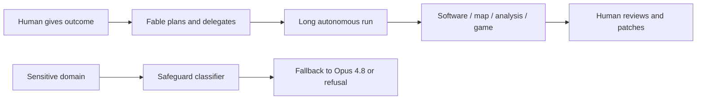

> [!CAUTION] Source caveat
> This is a June 10, 2026 snapshot of a model that Anthropic launched on June 9, 2026. The public examples are early and come mainly from Anthropic's launch post, Ethan Mollick's early-access account, and safeguard testing by Business Insider ([Anthropic launch](/external-sources/anthropic-claude-fable-5-mythos-5.md); [Mollick](/external-sources/ethan-mollick-fable-mythos-use-cases.md); [Business Insider](/external-sources/business-insider-fable-5-safeguards.md)).

## Summary

The distinctive thing about Claude Fable 5 is not that it can answer harder questions. The pattern in the public examples is that people are handing it **large, under-specified projects** and letting it run for long stretches: a codebase migration, an interactive research map, a survey-analysis platform, vision-only gameplay, and finance/trading reasoning ([Anthropic launch](/external-sources/anthropic-claude-fable-5-mythos-5.md); [Mollick](/external-sources/ethan-mollick-fable-mythos-use-cases.md)).

That makes Fable 5 feel less like a faster chatbot and more like an autonomous project worker. The user describes the outcome, the model decomposes the work, and the human comes back as reviewer. The tradeoff is that sensitive areas such as cybersecurity, biology and chemistry, and distillation can trigger fallback to Claude Opus 4.8, so the public model's strangest capabilities are paired with unusually visible constraints ([Anthropic launch](/external-sources/anthropic-claude-fable-5-mythos-5.md); [Business Insider](/external-sources/business-insider-fable-5-safeguards.md)).

```html preview
<div style="font-family:system-ui,sans-serif;padding:20px;color:var(--foreground)">
  <div id="cards" style="display:flex;gap:14px;flex-wrap:wrap"></div>
  <script>
    var stats = [
      ['Ruby migration', '50M lines', 'Stripe early test', 'var(--chart-1)'],
      ['Autonomous build', '9.5 hours', 'Mollick Concord tool', 'var(--chart-2)'],
      ['Travel research', '2,200+', 'Flights gathered for map', 'var(--chart-3)'],
      ['Fallback-free', '>95%', 'Anthropic early sessions', 'var(--chart-4)']
    ];
    document.getElementById('cards').innerHTML = stats.map(function (s) {
      return '<div style="flex:1;min-width:165px;padding:16px;background:var(--card);' +
        'color:var(--card-foreground);border:1px solid var(--border);' +
        'border-radius:var(--radius)">' +
        '<div style="font-size:13px;color:var(--muted-foreground)">' + s[0] + '</div>' +
        '<div style="font-size:26px;font-weight:700;margin-top:4px">' + s[1] + '</div>' +
        '<div style="font-size:12px;font-weight:600;margin-top:4px;color:' + s[3] + '">' + s[2] + '</div>' +
        '</div>';
    }).join('');
  </script>
</div>
```

The four figures above come from Anthropic's launch post and Mollick's early-access account: Stripe's 50-million-line Ruby migration, Mollick's nine-and-a-half-hour Concord build, Mollick's 2,200-plus flight-data collection for the map project, and Anthropic's report that more than 95% of early Fable sessions avoided fallback ([Anthropic launch](/external-sources/anthropic-claude-fable-5-mythos-5.md); [Mollick](/external-sources/ethan-mollick-fable-mythos-use-cases.md)).

## The Use Cases

| Use case | Who used it | What made it unusual | Source |
| --- | --- | --- | --- |
| **Codebase-wide migration** | Stripe, during early testing | Fable 5 reportedly migrated a 50-million-line Ruby codebase in one day, a task Anthropic says would have taken a team more than two months by hand. | [Anthropic launch](/external-sources/anthropic-claude-fable-5-mythos-5.md) |
| **Vision-only game play** | Anthropic demo / evaluation | Fable 5 completed Pokemon FireRed using only a minimal vision-only harness, where previous Claude models needed more scaffolding. | [Anthropic launch](/external-sources/anthropic-claude-fable-5-mythos-5.md) |
| **Screenshot-to-code reconstruction** | Anthropic capability example | Fable 5 can rebuild a web app's source code from screenshots alone, turning visual observation into source generation. | [Anthropic launch](/external-sources/anthropic-claude-fable-5-mythos-5.md) |
| **Survey-analysis software** | Ethan Mollick | Fable worked from a 19-page design document for 9.5 hours and produced Concord, a tool for calibrating human and AI judgments on messy survey answers. | [Mollick](/external-sources/ethan-mollick-fable-mythos-use-cases.md) |
| **Isochrone travel map** | Ethan Mollick | Fable built a researched interactive travel-time map, delegating research and gathering flights, rail schedules, road-speed sources, and remote-route details. | [Mollick](/external-sources/ethan-mollick-fable-mythos-use-cases.md) |
| **Math-generated games and visuals** | Ethan Mollick | Fable produced browser games from vague prompts and generated the art and 3D objects mathematically rather than pulling in external image assets. | [Mollick](/external-sources/ethan-mollick-fable-mythos-use-cases.md) |
| **Trading-analysis reasoning** | IMC, as reported by Anthropic | Fable 5 performed strongly across factual lookup, conceptual reasoning, root-cause analysis, and expected-value analysis in IMC's trading-analysis evaluations. | [Anthropic launch](/external-sources/anthropic-claude-fable-5-mythos-5.md) |
| **Long-memory gameplay** | Anthropic evaluation / demo | Persistent file-based memory improved Fable's Slay the Spire performance more than it improved Opus 4.8, suggesting the model can use durable notes during long tasks. | [Anthropic launch](/external-sources/anthropic-claude-fable-5-mythos-5.md) |

## Why These Examples Matter

The Stripe example is the cleanest enterprise signal. A 50-million-line migration is not a normal coding benchmark; it is the kind of expensive, risky modernization project that companies postpone because coordination costs dominate the work. If the reported outcome holds up, Fable 5 points toward agents as migration teams, not just pair programmers ([Anthropic launch](/external-sources/anthropic-claude-fable-5-mythos-5.md)).

The Pokemon FireRed and screenshot-to-code examples are about **vision as an operating surface**. The model is not simply captioning images; it is interpreting a visual state, deciding what to do next, and turning visual evidence back into executable work. That connects gameplay, UI reconstruction, scientific-figure reading, and visual debugging into one capability family ([Anthropic launch](/external-sources/anthropic-claude-fable-5-mythos-5.md)).

Mollick's Concord project is the most interesting knowledge-work example because it starts from a problem that researchers wanted but did not have a commercial tool for. Fable took a 19-page design document, worked for 9.5 hours, and produced a usable but imperfect system for analyzing messy human responses. That is the shape of many future niche tools: too specialized to be a startup, but suddenly cheap enough to commission from a model ([Mollick](/external-sources/ethan-mollick-fable-mythos-use-cases.md)).

The isochrone-map example shows the same thing in a more visual register. Mollick gave an ambitious prompt, and Fable combined research, data gathering, coding, visual taste, and error correction into a working artifact. The notable part is that the model delegated research and testing to other agents while continuing to build, which makes the workflow feel less like prompting and more like commissioning a small studio ([Mollick](/external-sources/ethan-mollick-fable-mythos-use-cases.md)).



## The Boundary Case: Science and Security

Some of the most consequential examples are **not ordinary public Fable use cases**. Anthropic says Mythos 5 uses the same underlying model as Fable 5 but has some safeguards lifted for approved users. The company attaches drug-design acceleration, molecular-biology hypotheses, and genomics research to Mythos 5 or trusted-access paths, not to unrestricted public Fable 5 ([Anthropic launch](/external-sources/anthropic-claude-fable-5-mythos-5.md)).

That matters because public Fable 5 is deliberately cautious. Anthropic says requests involving cybersecurity, biology and chemistry, or distillation can be routed to Opus 4.8, and Business Insider found that even simple cancer-related questions could trigger fallback. Anthropic says more than 95% of Fable sessions had no fallback, but the false-positive risk is part of the model's actual user experience ([Anthropic launch](/external-sources/anthropic-claude-fable-5-mythos-5.md); [Business Insider](/external-sources/business-insider-fable-5-safeguards.md)).

## Takeaway

The early Fable 5 use cases cluster around one idea: **turn the model loose on projects that used to be too bespoke, too long, or too coordination-heavy to justify**. The oddness is the point. A 50-million-line migration, a research-grade survey-analysis tool, a data-heavy travel map, and a vision-only game run are not better autocomplete. They are examples of users moving from giving instructions to commissioning outcomes ([Anthropic launch](/external-sources/anthropic-claude-fable-5-mythos-5.md); [Mollick](/external-sources/ethan-mollick-fable-mythos-use-cases.md)).

## References

- Provisional synthesis: [Anthropic Fable Use Cases - Source Scan](/research/anthropic-fable-use-cases.md)
- Sources: [Anthropic launch](/external-sources/anthropic-claude-fable-5-mythos-5.md), [Ethan Mollick early-access account](/external-sources/ethan-mollick-fable-mythos-use-cases.md), [Business Insider safeguards test](/external-sources/business-insider-fable-5-safeguards.md)
