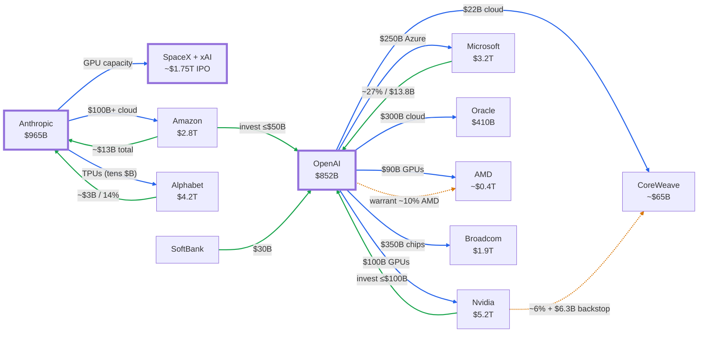

## Question

What's the data behind a Bloomberg-style "AI circular financing" chart — entities sized by market value, connected by typed money/compute flows — for the impending tech IPOs (OpenAI, Anthropic, SpaceX) and their counterparties?

## Context

This doc is the dataset and visualization for the funding web. The three companies in this KB ([OpenAI](/research/openai.md), [Anthropic](/research/anthropic.md), [SpaceX](/research/spacex.md)) sit inside a dense web where the same firms are **investors, suppliers, and customers of each other** — the dynamic critics call "circular financing." All figures trace to the [external sources](/external-sources/openai-infrastructure-1-15-trillion.md) cited below.

> [!NOTE] How to read this
> Two dimensions, mirroring Bloomberg's chart: (1) **node size = market value / valuation**; (2) **edges = typed relationships** (investment, compute purchase, equity stake). Public market caps are a May 2026 snapshot ([source](/external-sources/market-caps-may-2026.md)); private valuations are each company's latest round/filing.

## The original chart (reference)

This is the Bloomberg chart that inspired this doc. The sections below recreate it with current mid-2026 data.


*Source: [Bloomberg — AI circular-financing web](/external-sources/bloomberg-ai-circular-financing-chart.md) (figures are late-2025).*

## Circles sized by market value

```html preview
<div style="font-family:system-ui,sans-serif;padding:16px;color:var(--foreground)">
  <h3 style="margin:0 0 6px;font-size:15px;font-weight:600">AI capital web — sized by market value / valuation (mid-2026)</h3>
  <div style="display:flex;gap:16px;flex-wrap:wrap;font-size:12px;color:var(--muted-foreground);margin-bottom:12px">
    <span><span style="display:inline-block;width:10px;height:10px;border-radius:50%;background:var(--chart-5);margin-right:5px"></span>AI lab (impending IPO)</span>
    <span><span style="display:inline-block;width:10px;height:10px;border-radius:50%;background:var(--chart-1);margin-right:5px"></span>Chipmaker</span>
    <span><span style="display:inline-block;width:10px;height:10px;border-radius:50%;background:var(--chart-2);margin-right:5px"></span>Cloud / hyperscaler</span>
    <span>dashed outline = private</span>
  </div>
  <svg id="webbubbles" style="width:100%;height:auto;display:block" viewBox="0 0 800 400" role="img" aria-label="Bubble chart of AI capital-web companies sized by market value: Nvidia 5.2T, Alphabet 4.2T, Microsoft 3.2T, Amazon 2.8T, Broadcom 1.9T, SpaceX 1.75T, Anthropic 965B, OpenAI 852B, Oracle 410B, AMD ~400B, CoreWeave ~65B"></svg>
  <script>
    var data = [
      {n:'Nvidia', v:5200, c:'var(--chart-1)'},
      {n:'Alphabet', v:4200, c:'var(--chart-2)'},
      {n:'Microsoft', v:3200, c:'var(--chart-2)'},
      {n:'Amazon', v:2800, c:'var(--chart-2)'},
      {n:'Broadcom', v:1900, c:'var(--chart-1)'},
      {n:'SpaceX+xAI', v:1750, c:'var(--chart-5)', p:1},
      {n:'Anthropic', v:965, c:'var(--chart-5)', p:1},
      {n:'OpenAI', v:852, c:'var(--chart-5)', p:1},
      {n:'Oracle', v:410, c:'var(--chart-2)'},
      {n:'AMD', v:400, c:'var(--chart-1)'},
      {n:'CoreWeave', v:65, c:'var(--chart-2)'}
    ];
    var maxV = 5200, W = 800, pad = 20, x = pad, y = 20, rowR = 0, parts = [];
    function fmt(v){ return v >= 1000 ? '$' + (v/1000) + 'T' : '$' + v + 'B'; }
    data.forEach(function(d){
      var r = 20 + 78 * Math.sqrt(d.v / maxV);
      if (x + 2*r + pad > W && x > pad) { y += rowR*2 + 54; x = pad; rowR = 0; }
      var cx = x + r, cy = y + r;
      parts.push('<circle cx="'+cx+'" cy="'+cy+'" r="'+r+'" fill="'+d.c+'" fill-opacity="0.22" stroke="'+d.c+'" stroke-width="2.5"'+(d.p?' stroke-dasharray="5 4"':'')+'/>');
      parts.push('<text x="'+cx+'" y="'+(cy+r+17)+'" text-anchor="middle" font-size="12.5" font-weight="600" fill="var(--foreground)">'+d.n+'</text>');
      parts.push('<text x="'+cx+'" y="'+(cy+r+32)+'" text-anchor="middle" font-size="11.5" fill="var(--muted-foreground)">'+fmt(d.v)+'</text>');
      x += 2*r + pad + 18; rowR = Math.max(rowR, r);
    });
    var H = y + rowR*2 + 54;
    var svg = document.getElementById('webbubbles');
    svg.setAttribute('viewBox', '0 0 ' + W + ' ' + H);
    svg.innerHTML = parts.join('');
  </script>
</div>
```

## The relationship web (typed flows)

Edge colors: <span style="color:#16a34a">**green = investment into a lab**</span> · <span style="color:#2563eb">**blue = compute / cloud purchase by a lab**</span> · <span style="color:#d97706">**amber (dashed) = equity stake / warrant / backstop**</span>.



## Node dataset

| Entity | Category | Market value / valuation | Public? | Basis |
| --- | --- | ---: | --- | --- |
| Nvidia | Chipmaker | \~$5.2T | Public | [Market caps](/external-sources/market-caps-may-2026.md) |
| Alphabet (Google) | Cloud/chips | \~$4.2T | Public | [↗](/external-sources/market-caps-may-2026.md) |
| Microsoft | Hyperscaler | \~$3.2T | Public | [↗](/external-sources/market-caps-may-2026.md) |
| Amazon | Hyperscaler | \~$2.8T | Public | [↗](/external-sources/market-caps-may-2026.md) |
| Broadcom | Chipmaker | \~$1.9T | Public | [↗](/external-sources/market-caps-may-2026.md) |
| SpaceX + xAI | Space/AI lab | \~$1.75T (IPO target) | Going public \~Jun 2026 | [SpaceX S-1](/external-sources/spacex-ipo-s1-filing.md) |
| Anthropic | AI lab | \~$965B | Private | [Series H](/external-sources/anthropic-series-h-65b.md) |
| OpenAI | AI lab | \~$852B | Confidential IPO filing | [$122B round](/external-sources/openai-122b-funding-round.md) |
| Oracle | Cloud | \~$410B | Public | [↗](/external-sources/market-caps-may-2026.md) |
| AMD | Chipmaker | \~$0.3–0.5T (verify live) | Public | [↗](/external-sources/market-caps-may-2026.md) |
| CoreWeave | Cloud (GPU) | \~$0.05–0.08T (verify live) | Public | [↗](/external-sources/market-caps-may-2026.md) |

## Edge dataset

| From | → To | Type | Size | When | Source |
| --- | --- | --- | ---: | --- | --- |
| Nvidia | OpenAI | Investment | up to $100B | Sep 2025 (LOI) | [↗](/external-sources/openai-nvidia-10gw-partnership.md) |
| Amazon | OpenAI | Investment | up to $50B | Mar 2026 | [↗](/external-sources/openai-122b-funding-round.md) |
| SoftBank | OpenAI | Investment | $30B | Mar 2026 | [↗](/external-sources/openai-122b-funding-round.md) |
| Microsoft | OpenAI | Equity stake | ~~27% (~~$135B) | Oct 2025 | [↗](/external-sources/microsoft-openai-pbc-restructuring.md) |
| Amazon | Anthropic | Investment | \~$13B (+ up to $20B) | 2023–26 | [↗](/external-sources/anthropic-amazon-compute.md) |
| Google | Anthropic | Investment | \~$3B / \~14% stake | 2023–26 | [↗](/external-sources/anthropic-google-tpu-deal.md) |
| OpenAI | Oracle | Compute purchase | \~$300B | Jul–Sep 2025 | [↗](/external-sources/openai-oracle-300b-stargate.md) |
| OpenAI | Microsoft | Compute purchase | \~$250B Azure | Oct 2025 | [↗](/external-sources/microsoft-openai-pbc-restructuring.md) |
| OpenAI | Broadcom | Compute purchase | \~$350B (FT est.) | Oct 2025 | [↗](/external-sources/openai-broadcom-10gw-accelerators.md) |
| OpenAI | Nvidia | Compute purchase | \~$100B (10 GW) | Sep 2025 | [↗](/external-sources/openai-nvidia-10gw-partnership.md) |
| OpenAI | AMD | Compute purchase | \~$90B (6 GW) | Oct 2025 | [↗](/external-sources/openai-amd-6gw-partnership.md) |
| OpenAI | Amazon (AWS) | Compute purchase | \~$38B | Nov 2025 | [↗](/external-sources/openai-infrastructure-1-15-trillion.md) |
| OpenAI | CoreWeave | Compute purchase | \~$22.4B | 2025 | [↗](/external-sources/openai-coreweave-contracts.md) |
| Anthropic | Amazon (AWS) | Compute purchase | $100B+ / 10yr (5 GW) | Apr 2026 | [↗](/external-sources/anthropic-amazon-compute.md) |
| Anthropic | Google | Compute purchase | tens of $B (≤1M TPUs) | Oct 2025 | [↗](/external-sources/anthropic-google-tpu-deal.md) |
| Anthropic | SpaceX (Colossus) | Compute purchase | undisclosed | May 2026 | [↗](/external-sources/anthropic-series-h-65b.md) |
| OpenAI | AMD | Warrant / equity | up to \~10% of AMD | Oct 2025 | [↗](/external-sources/openai-amd-6gw-partnership.md) |
| Nvidia | CoreWeave | Stake + backstop | \~6% + $6.3B | 2025 | [↗](/external-sources/openai-coreweave-contracts.md) |

## Why it's called "circular financing"

The money flows in loops — the same dollars appear to circulate between supplier and customer:

- **Nvidia ↔ OpenAI:** Nvidia invests *up to $100B into* OpenAI, and OpenAI commits \~$100B to *buy Nvidia GPUs* ([Nvidia](/external-sources/openai-nvidia-10gw-partnership.md)).
- **AMD ↔ OpenAI:** AMD hands OpenAI a warrant for \~10% of AMD priced at $0.01, and OpenAI commits to \~$90B of *AMD GPUs* — chips-for-equity ([AMD](/external-sources/openai-amd-6gw-partnership.md)).
- **Nvidia → CoreWeave → OpenAI/Microsoft:** Nvidia owns \~6% of CoreWeave *and* backstops $6.3B of its capacity; CoreWeave then sells GPU cloud to OpenAI and Microsoft — who are themselves Nvidia's largest customers ([CoreWeave](/external-sources/openai-coreweave-contracts.md)).
- **Amazon ↔ Anthropic** and **Google ↔ Anthropic:** each hyperscaler invests equity *and* sells (or co-designs) the compute Anthropic runs on ([Amazon](/external-sources/anthropic-amazon-compute.md), [Google](/external-sources/anthropic-google-tpu-deal.md)).

> [!CAUTION] The bubble debate
> Critics argue these vendor-financed, milestone-gated commitments inflate headline numbers without matching cash. NYU's Aswath Damodaran questions whether the revenue growth implied is achievable ([OpenAI round](/external-sources/openai-122b-funding-round.md)); Oracle's stock has *fallen ~56%* from its high on AI-capex skepticism ([market caps](/external-sources/market-caps-may-2026.md)); and commentators note deals are increasingly described in "gigawatts and tokens" rather than revenue.

## Where SpaceX connects

SpaceX is *not* a node in the OpenAI/Nvidia financing loop. Its single concrete tie is via the **xAI merger** (Feb 2026): xAI's **Colossus** data centers now sit inside SpaceX, and **Anthropic's Series H names SpaceX as a compute partner** (GPU capacity in Colossus 1 & 2) ([Anthropic Series H](/external-sources/anthropic-series-h-65b.md)). So post-merger SpaceX is a *compute supplier* to the web, even though its core business (launch + Starlink) is separate. Full profile: [SpaceX](/research/spacex.md).

## Open questions

- **Firm vs. contingent:** how much of the edge dataset is binding cash vs. LOIs / milestone-gated warrants? (Several Nvidia/AMD/Broadcom figures are non-binding or conditional.)
- **Double-counting:** investment dollars that flow back out as compute purchases may be counted on both sides of the web.
- **Live market caps:** AMD and CoreWeave node sizes need a live refresh; this snapshot is approximate.

## Further reading

- Company profiles: [OpenAI](/research/openai.md) · [Anthropic](/research/anthropic.md) · [SpaceX](/research/spacex.md)
- Key sources: [$1.15T infra breakdown](/external-sources/openai-infrastructure-1-15-trillion.md) · [Market caps](/external-sources/market-caps-may-2026.md) · and the per-deal sources linked in the edge table above.

